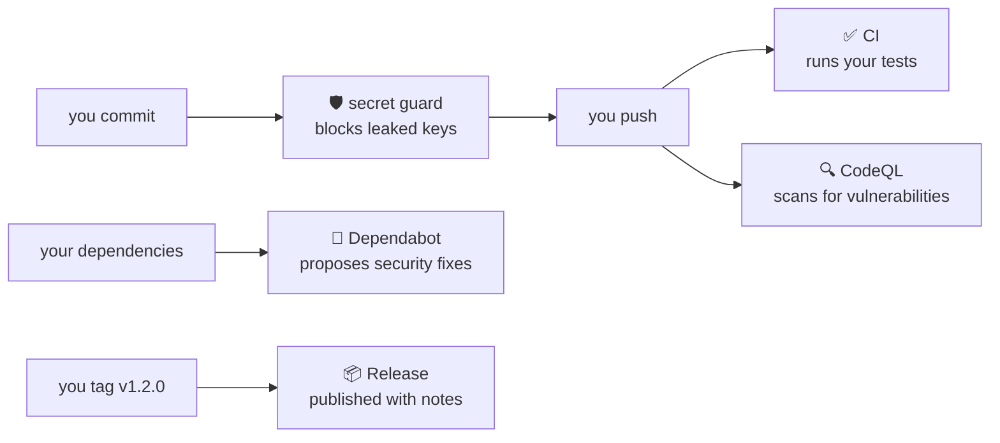

<div align="center">

# ⚓ shipshape

### A proper software delivery process for any repository —<br>set up in one conversation, in plain English.

[](https://github.com/KevNev19/shipshape/actions/workflows/ci.yml)
[](https://github.com/KevNev19/shipshape/actions/workflows/codeql.yml)
[](https://github.com/KevNev19/shipshape/releases)
[](LICENSE)

**Scan → five questions → preview → done.**<br>
No expertise required · nothing overwritten · everything explained

</div>

---

You have a project. Maybe you're a seasoned engineer, maybe you've never
heard the word "CI" — either way, your repository deserves automated tests,
secret protection, dependency monitoring, and releases that don't rely on
memory and luck.

**Shipshape** is a [Claude Code](https://claude.com/claude-code) plugin that
sets all of that up for you, conversationally. It scans your repo, asks a
handful of plain-language questions, shows you exactly what it will create,
and writes it on your go-ahead. Everything it writes is standard, boring,
reliable tooling — delete the plugin tomorrow and your setup keeps working.

## How it feels

```text
you>  /shipshape-init

      This looks like a Python project that uses pytest for its tests — is that right?

you>  yep. it's just me working on it

      Got it: solo, changes go straight to main, protected by automated checks.
      Here's the plan — 12 files, and nothing you already have gets touched:

        .github/workflows/ci.yml      runs your tests automatically after every push
        .sdlc/hooks/secret-guard.sh   blocks passwords and API keys at commit time
        docs/sdlc/harness.md          your working agreement, in plain English
        ...

      Shall I go ahead?
```

Two minutes later there's a green check on your next push, a guard on every
commit, and a `docs/sdlc/` folder that explains itself.

## What's watching your back



Security is the centre of the kit, not an add-on: every guardrail is **on by
default**, and switching one off means hearing the consequence in one plain
sentence and saying yes anyway.

## The commands

| Command | What it does |
|---|---|
| ⚓ `/shipshape-init` | Scan, interview, preview, set up. The front door. |
| 🩺 `/shipshape-doctor` | Health check — security first, one suggested next action. |
| 👀 `/shipshape-review` | Explains any change in plain language, ends on a clear verdict. |
| 🚢 `/shipshape-release` | Guided releases: right version number, honest notes, one tag. |
| 🔑 `/shipshape-access` | "Give Sam access" → the exact GitHub command, shown before it runs. |
| 🎛️ `/shipshape-customize` | Change anything off the defaults; only the affected files regenerate. |

## Get it

Inside Claude Code, in any repository:

```text
/plugin marketplace add KevNev19/shipshape
/plugin install shipshape@shipshape
/shipshape-init
```

Needs `git` and `python3` (preinstalled on macOS and most Linux). The
GitHub CLI (`gh`) unlocks access management and branch protection — shipshape
will tell you if it's missing, and what to click instead.

## Why you can trust it with your repo

- **Nothing is ever clobbered.** Shipshape remembers the fingerprint of every
  file it writes. Edit one, and it becomes *yours* — future runs report it
  and ask, file by file, before touching it. There is no silent overwrite
  path in the codebase, and there are tests to keep it that way.
- **Every file explains itself.** Each generated file opens with what it is,
  why you have it, and whether it's safe to edit. A glossary defines every
  term the tooling uses.
- **Plain words, honest verdicts.** Skills translate — "the login test
  expected X and got Y" — and a red CI never gets called "looks safe".
- **It runs on itself.** This repository was set up by shipshape: the badges
  above, the release you're reading about, the secret guard that inspected
  every one of its commits — all its own output. Dependabot's first PR
  arrived one minute after publish. See [`docs/sdlc/`](docs/sdlc/).

## Make it yours

One file — `.sdlc/config.json` — drives everything: working style
(straight-to-main or pull-request), team or solo, features on or off, test
command, reviewers. Change it with `/shipshape-customize`; shipshape
regenerates only what's affected and leaves your edits alone.

## Under the hood

For the curious: a stdlib-only Python engine (`detect.py` → `render.py` →
`doctor.py`), token-substitution templates with zero template logic,
frozen-fixture tests, and one dated regression test per bug ever fixed.
Decisions are recorded in [`docs/adr/`](docs/adr/). Run the whole pipeline
against a scratch repo with `bash tests/e2e.sh`.

<div align="center">

*Get your repository shipshape.*

MIT © [KevNev19](https://github.com/KevNev19)

</div>
